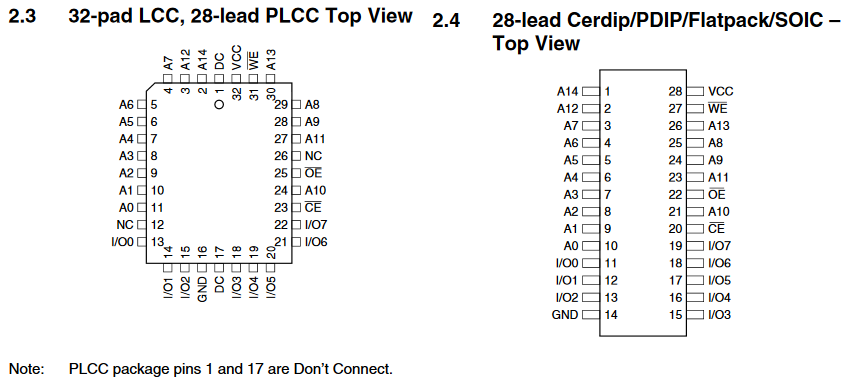
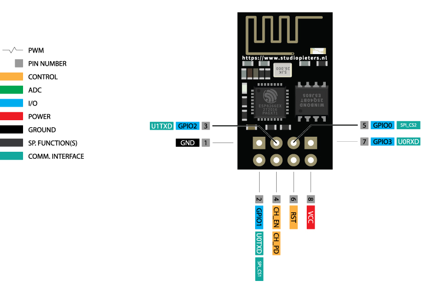

# IoT-Extension-Cable

The goal of this project is to control 4 independent power outlets with one ESP-8266 or via the buttons on the case.

Since the ESP-8266 only has 4 GPIO pins, an EEPROM is introduced to act as a state machine and handle both the button actions, the ESP-8266 actions and to feed data back to the ESP-8266.

## Components

### EEPROM AT28C256

### ESP8266

