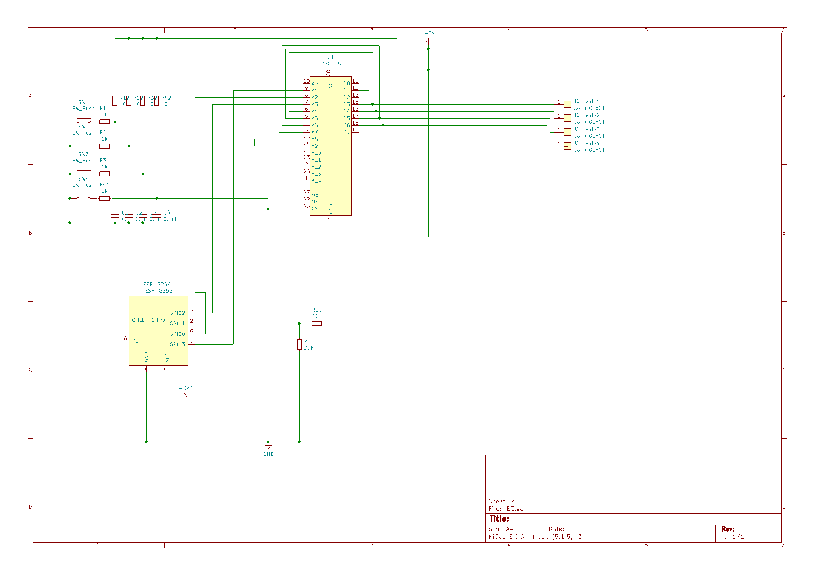

# IoT-Extension-Cable

The goal of this project is to control 4 independent power outlets with one ESP-8266 or via the buttons on the case.

Since the ESP-8266 only has 4 GPIO pins, an EEPROM is introduced to act as a state machine and handle both the button actions, the ESP-8266 actions and to feed data back to the ESP-8266.

Three IO pins of the ESP-8266 are used as input to the EEPROM. The forth is connected via a voltage divider to the EEPROM-data pins. The basic approach is to use two EEPROM-input pins to address a given port, for which the current value is sent back to the ESP-8266 via the one feedback wire. The forth GPIO port which is also connected to the EEPROM input should be used to flip the currently addressed value.

To handle timing issues, the temporary 'transition' state is introduced. This is set on the rising edge of the 'flip' logic and reset on the falling edge of the same pin.

The schematic for the buttons also include a basic debounce logic (low pass filter). 

## Components

### EEPROM AT28C256

### ESP8266

## Schematic

